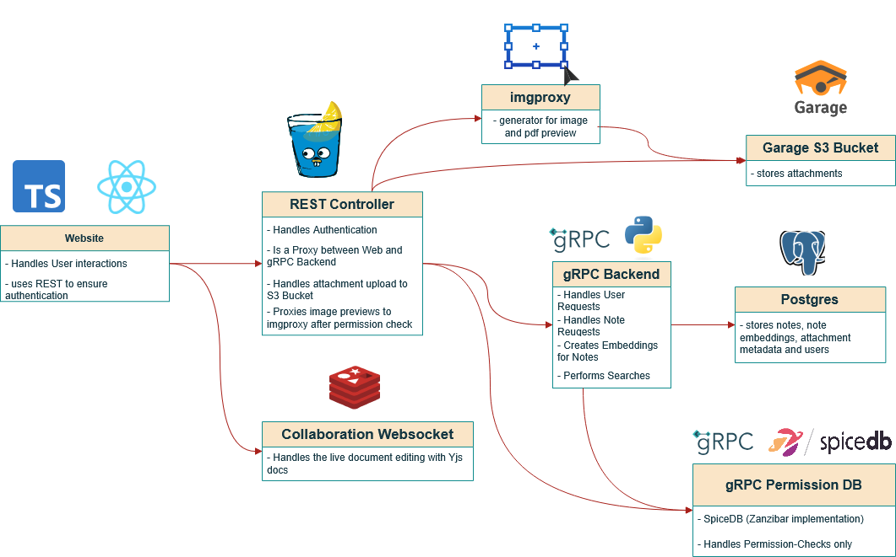

# Wersu
### Project Structure


# Todo
- better logging, more di
- don't regenerate embedding generator too often 

# Development Docs
### Compile Protobufs (`.proto` files):
1. install requirements:
    ```bash
    pip install -r requirements.txt
    ```
2. [install protobuf compiler on the system](https://github.com/protocolbuffers/protobuf#protobuf-compiler-installation)
3. compile the `src/grpc_mod/note.proto` and `src/grpc_mod/user.proto`file:
    ```bash
    python -m grpc_tools.protoc \
            -I. \
            --python_out=. \
            --grpc_python_out=. \
            --mypy_out=. \
            src/grpc_mod/proto/*.proto
    ```

### Start gRPC server
```bash
docker compose down; rm -r data; docker compose up --build -d; env PYTHONTRACEMALLOC=1 python -m src.main
```

### Run tests in a new environment
1. Create and activate a virtual environment:
    ```bash
    python -m venv .venv
    source .venv/bin/activate
    ```

2. Install project and test dependencies:
    ```bash
    python -m pip install --upgrade pip
    pip install -r src/requirements.txt
    pip install -r src/requirements-dev.txt
    ```

3. Run the default test suite (integration tests are excluded by default):
    ```bash
    pytest tests/
    ```

4. Run SpiceDB integration tests (requires Docker running, started automatically via testcontainers):
    ```bash
    pytest -m "integration and spicedb" tests/
    ```

5. Optional: run everything (including integration):
    ```bash
    pytest -o addopts='' tests/
    ```