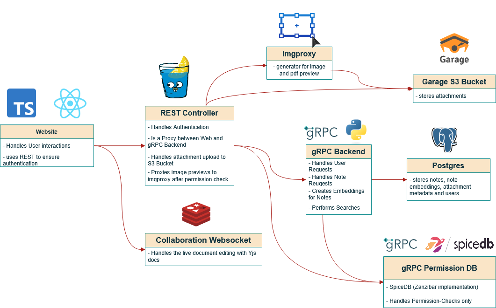

# Wersu

# Getting Started

Clone, generate `.env`, run docker, and update.

```bash
# 1. Clone
git clone https://github.com/KuramaSyu/WerSu.git
cd WerSu

# 2. Generate .env.prod (interactive, prompts for everything)
./scripts/generate-prod-env.py

# 3. Bring the stack up
docker compose -f docker-compose.prod.yaml --env-file .env.prod up -d

# 4. To update after pulling new images or a new IMAGE_TAG
docker compose -f docker-compose.prod.yaml --env-file .env.prod pull
docker compose -f docker-compose.prod.yaml --env-file .env.prod up -d
```

The prod compose assumes a host-level Traefik is already running on
the `proxy` Docker network. See
[docs/prod-deployment.md](docs/prod-deployment.md) for the full setup.

### Project Structure



# Development Docs
### Logging configuration
Logging levels can be configured with a YAML file. By default the app looks for `logging.yaml` in the workspace root, or you can override the path with `LOGGING_CONFIG_PATH`.

Example:
```yaml
level: INFO
loggers:
    __main__: DEBUG
    src: DEBUG
    src.db.database: WARNING
```

Logger names use the most specific match, so `src.db.database` wins over `src`.

### Compile Protobufs (`.proto` files):
1. install requirements:
    ```bash
    uv sync
    ``` 
    or (old version)
    ```bash
    pip install -r requirements.txt
    ```
2. [install protobuf compiler on the system](https://github.com/protocolbuffers/protobuf#protobuf-compiler-installation)
3. compile the `src/grpc_mod/note.proto` and `src/grpc_mod/user.proto`file:
    ```bash
    uv run python -m grpc_tools.protoc \
        -I . \
        --python_out=. \
        --grpc_python_out=. \
        --mypy_out=. \
        src/grpc_mod/proto/*.proto
    ```

### Start gRPC server
```bash
docker compose down; rm -r data; docker compose up --build -d; env PYTHONTRACEMALLOC=1 python -m src.main
```

### Pytest and setup
1. Create and activate a virtual environment:
    ```bash
    uv sync
    ```

- Run the default test suite (integration tests are excluded by default):
    ```bash
    uv run pytest
    ```

- Run the integration tests which use real databases (Postgres, SpiceDB, garage).  These live under `tests/integration/` and carry the `integration` marker:
    ```bash
    uv run pytest tests/integration/ -m integration
    ```

- Optional: run the full suite including both integration tests and POCs:
    ```bash
    uv run pytest -o addopts=''
    ```

- Optional: run proof of concepts (e.g. the Garage smoke test under `tests/pocs/`):
    ```bash
    uv run pytest tests/pocs/ -m poc
    ```