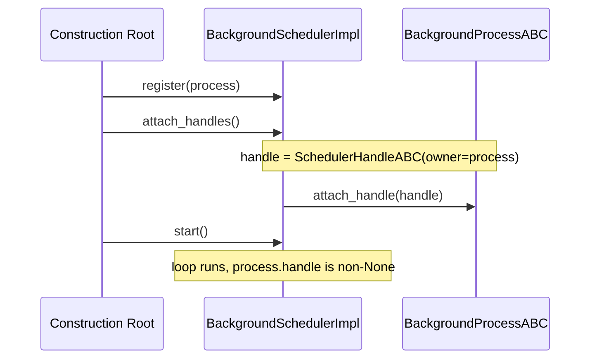
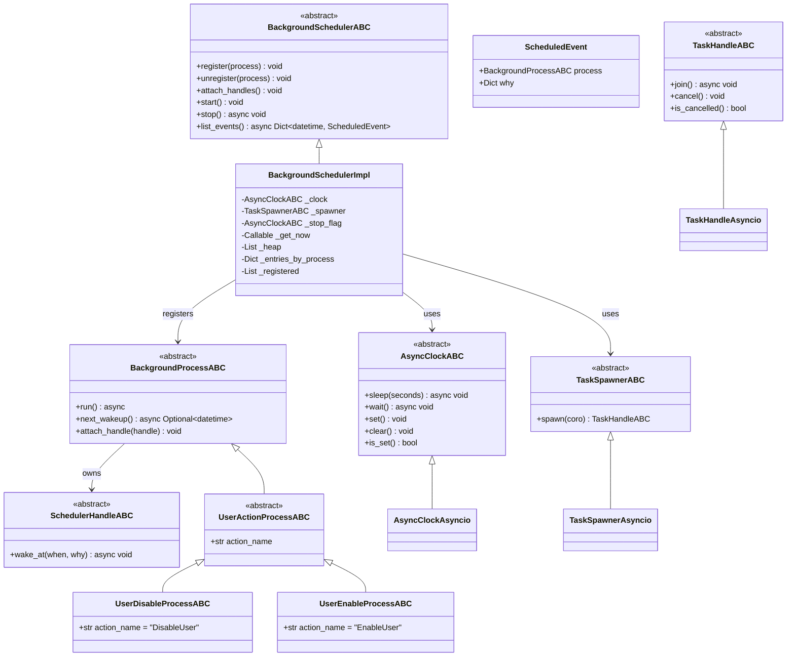
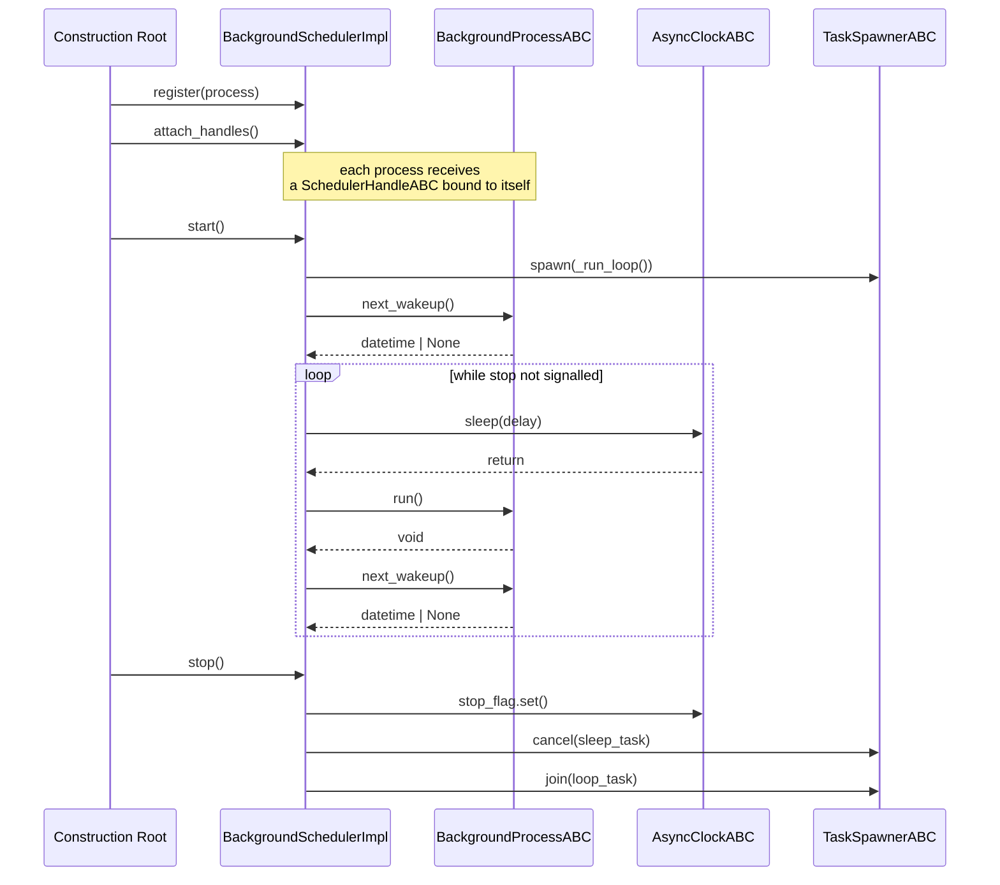
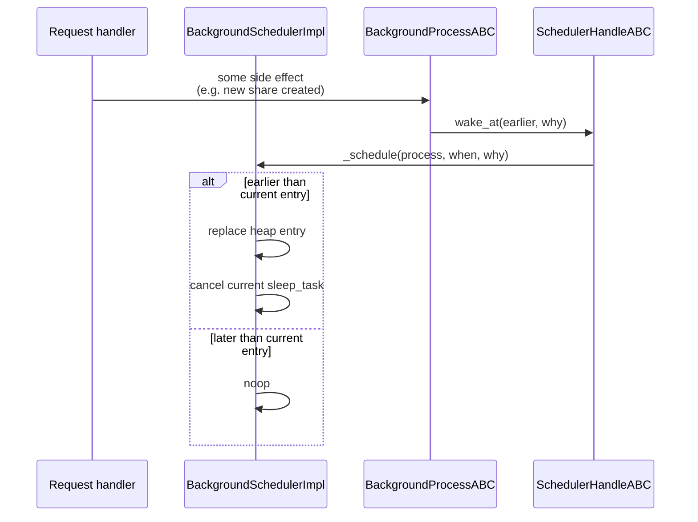
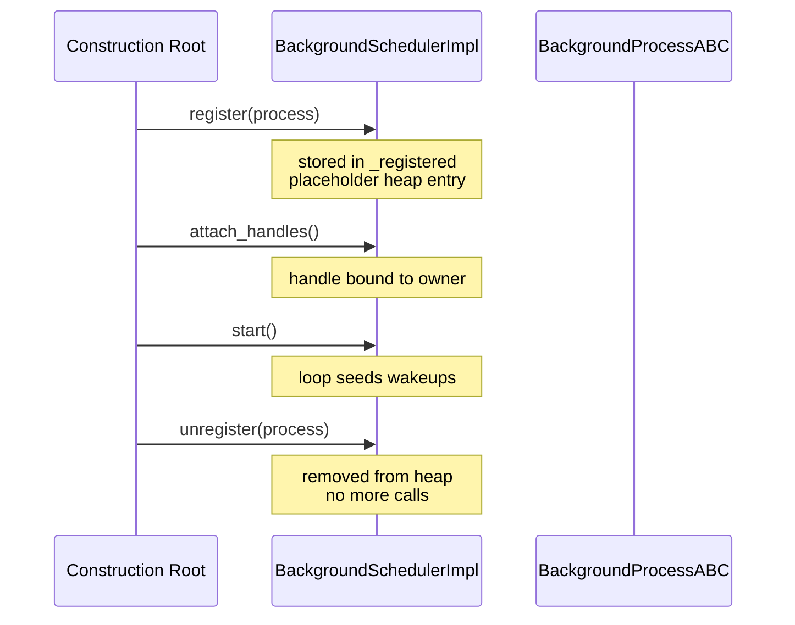

# Background processes

Short reference:
- **BackgroundProcessABC**: a unit of work the scheduler runs at a scheduled time.
- **BackgroundSchedulerImpl**: owns the heap of scheduled processes and drives the loop.
- **SchedulerHandleABC**: the per-process handle a process uses to push an earlier wakeup.
- **AsyncClockABC / TaskSpawnerABC / TaskHandleABC**: seams over `asyncio` so the scheduler is testable without a real running loop.
- **UserDisableProcessImpl / UserEnableProcessImpl**: the first two concrete processes; they execute pending `user_action` rows.

To keep it simple, this page only describes the lifecycle and the contracts.  The
concrete process list lives in
[`src/services/background_process/processes/`](../src/services/background_process/processes/).

## `attach_handles()` in short

One-shot seam between the scheduler and the registered processes. After
`register()` but before `start()`, it walks the registered list and binds a
`SchedulerHandleABC` to each process. The handle is what a process uses to
push an earlier wakeup via `wake_at(when, why)` without going through the
scheduler's public surface.

It exists separately from `register()` to break the cycle: the handle holds
a back-reference to the scheduler, and the process holds the handle. The
two-step `register` -> `attach_handles` -> `start` order guarantees the
background loop never calls `run()` on a process whose handle is still
`None`.

Most processes (e.g. `UserDisableProcessImpl`) never call `wake_at`; the
handle is only needed for the future share-expiry process, which is
woken from the share-creation path the moment a new share is inserted.

## Class diagram

## Lifecycle

## Pushing an earlier wakeup

The pull side (`next_wakeup`) seeds the heap; the push side
(`wake_at`) lets a process shorten its own pending sleep when
something external changes the schedule.

The `why` payload is a free-form `Dict[str, Any]` that must contain
at least `name` (e.g. `"DisableUser"`) and `description`
(human-readable prose), with any extras (`user_id`, `share_id`,
`action_id`, ...) for diagnosis.  The scheduler stores the most
recent `why` it received and surfaces it through `list_events()`.

## Register / unregister

`register` and `unregister` are observer-pattern style: they can
be called any time before `start`, and `unregister` may also be
called after `start` to drop a process from the running loop.