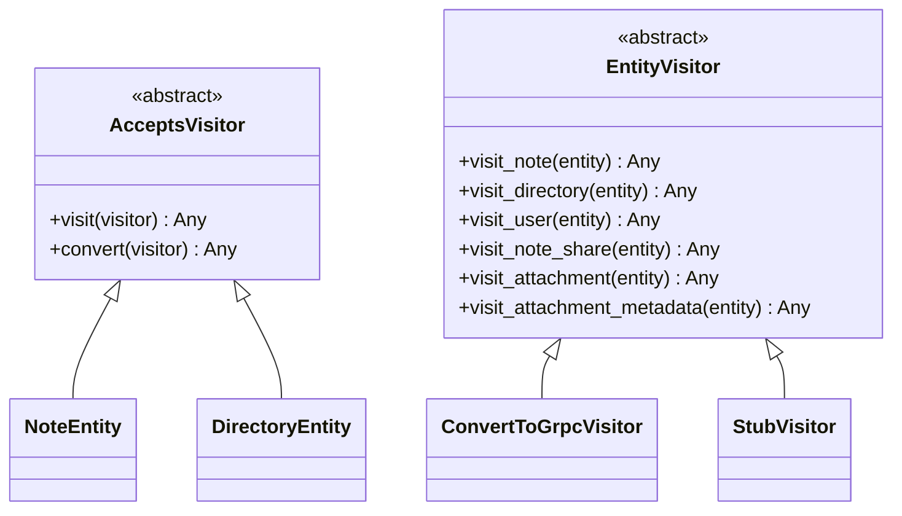
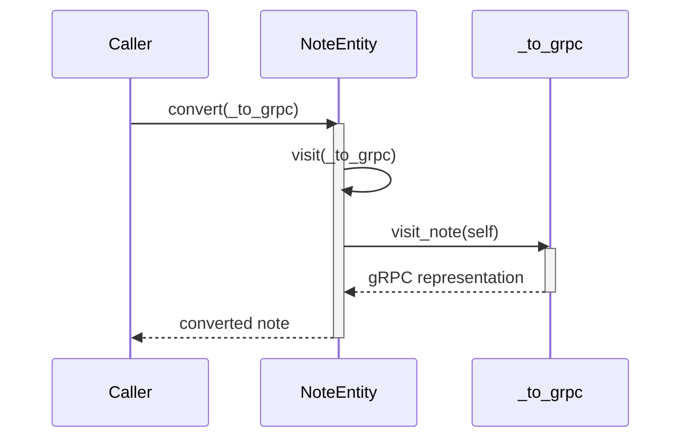

# Converters as Visitor Pattern

The gRPC layer uses the visitor pattern to convert domain entities
to protobuf messages.

* `:class:AcceptsVisitor` (in `src/db/entities/visitor.py`) is the
  base class every entity inherits, exposing `visit(visitor)` and its
  alias `convert(visitor)`.
* `:class:EntityVisitor` is the abstract visitor with one `visit_*`
  method per entity type.
* `:class:ConvertToGrpcVisitor` (in
  `src/grpc_mod/converter/grpc_visitor.py`) is the production visitor.
* `StubVisitor` (in `tests/stubs/visitor.py`) records every
  dispatched entity for unit tests.

A gRPC service takes the visitor as `to_grpc: ConvertToGrpcVisitor`
and calls `entity.convert(self._to_grpc)`; `convert` routes to the
matching `visit_*` handler.



Following a line like this:
```py
note_entity.convert(self._to_grpc)
```
Means, that a note entity (in this case) calls the `NoteEntity.visit(sef, v)` which,
for a note would result to 
`v.visit_note(self)`. This is also displayed in the following diagram.
The syntax to call it `.convert` instead of `.visit` and `to_grpc` instead of `visitor`
is just to make it good readable - a bit of syntactic zugar.

