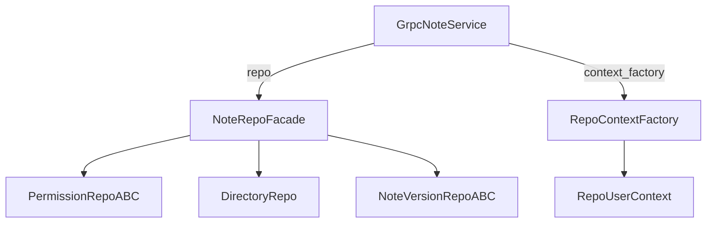
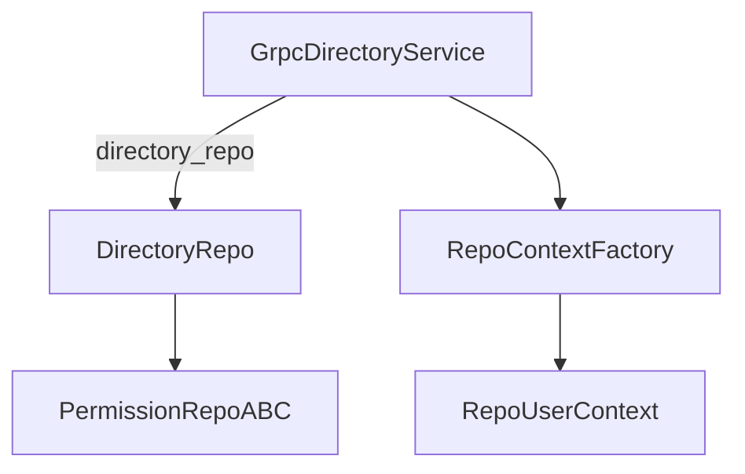
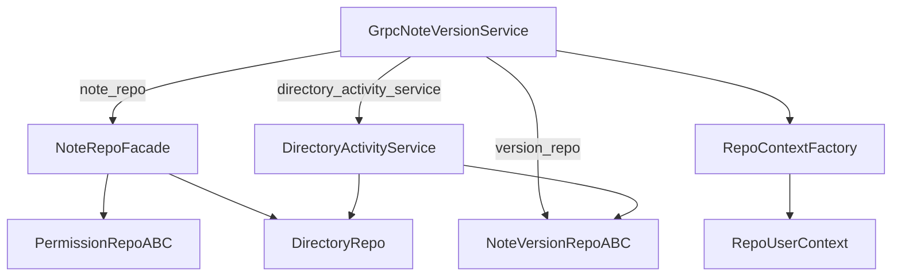
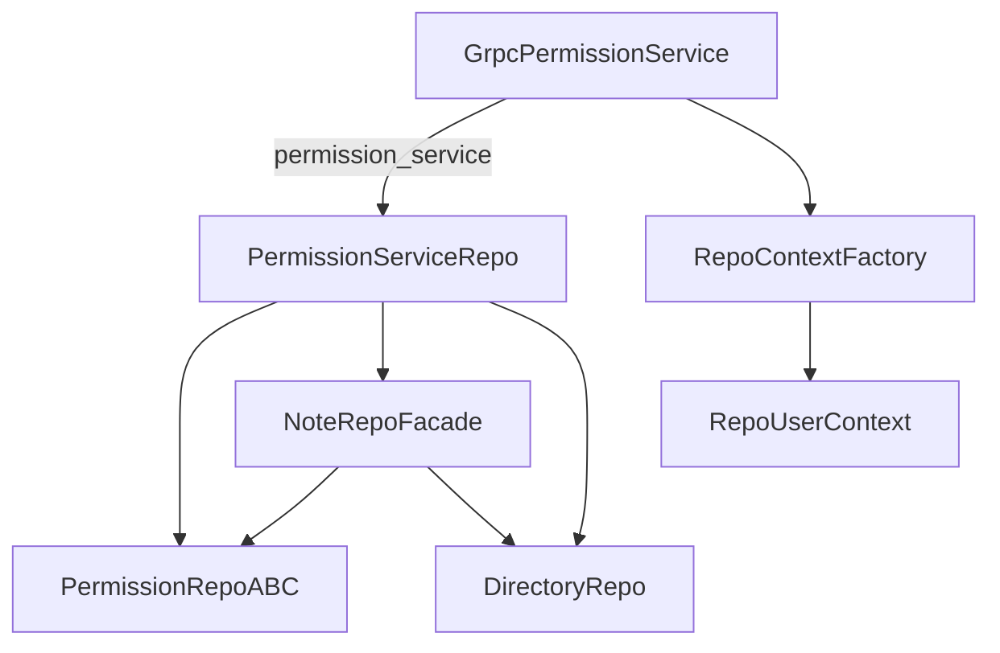
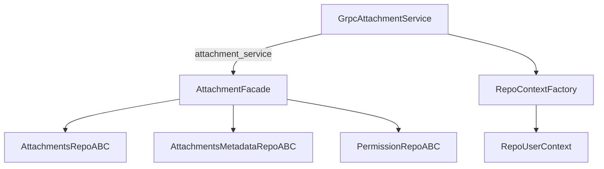
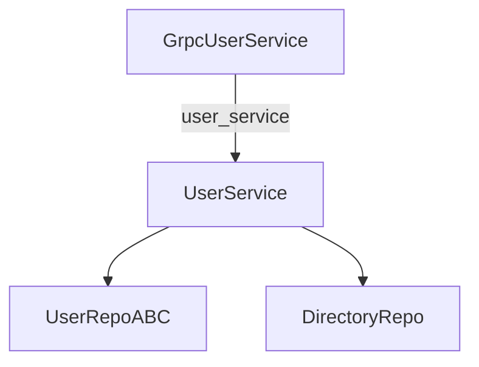
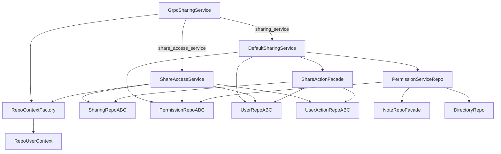

# Dependency Graph

This document describes how `src/main.py` wires the WerSu-gRPC service
together.  Every collaborator is constructed in `serve()` and handed to
the layer above it via constructor injection; nothing else in the
codebase knows how to build a concrete class.

The Construction Root (`serve()` in `src/main.py`) is the only place
in the codebase that knows about every concrete class.  Every
collaborator below it only depends on the ABCs defined in `src/api/`.

To keep it simple, this page only describes the static dependency
graph - failures, retries and graceful shutdown are handled elsewhere.

For an end-to-end view across all services, see the project-structure
doc instead.

---

## `GrpcNoteService`

Handles note CRUD plus embedding-backed search.  Built by the
Construction Root with `repo`, `log`, `to_grpc`, `context_factory`.

What `GrpcNoteService` calls on each request:

1. `await self._context.create(request.user_id / author_id)` to
   build a `RepoUserContext`.
2. Passes that context into `NoteRepoFacade.select_by_id`, `.insert`,
   `.update`, `.delete`, or `.search_notes`.

---

## `GrpcDirectoryService`

Reads and writes directories plus their SpiceDB relations.  Built by
the Construction Root with `directory_repo`, `log`, `to_grpc`,
`context_factory`.

`GrpcDirectoryService` only constructs a `RepoUserContext` for the
`GetDirectories` listing path; the other methods operate on the
directory id alone and let `DirectoryRepo` enforce permissions
against SpiceDB.

---

## `GrpcNoteVersionService`

Streams note version history and restores previous versions.  Built by
the Construction Root with `note_repo`, `version_repo`,
`directory_activity_service`, `log`, `to_grpc`, `context_factory`.

`GetDirectoryActivity` is the one method that goes through
`DirectoryActivityService.list_directory_activity`; everything else
talks to `version_repo` and `note_repo` directly.

---

## `GrpcPermissionService`

Manages note and directory permission relationships.  Built by the
Construction Root with `permission_service`, `log`, `to_grpc`,
`context_factory`.

Every RPC builds a fresh `actor: UserContextABC` and passes it into
`PermissionServiceRepo.list_relationships`,
`create_relationship`, `delete_relationship`, or
`replace_relationships`.

---

## `GrpcAttachmentService`

Uploads, downloads, links and unlinks note attachments.  Built by the
Construction Root with `attachment_service`, `log`, `to_grpc`,
`context_factory`.

The attachment facade enforces the permission check before delegating
to the S3 repo (`AttRepo`) and the Postgres-backed metadata repo
(`AttMetaRepo`).

---

## `GrpcUserService`

Creates and looks up users.  Built by the Construction Root with
`user_service`, `log`, `to_grpc`.

`GrpcUserService` is the only gRPC adapter that does not depend on
`RepoContextFactory` - `UserService` reads the user directly from
`UserRepoABC` and bootstraps the default zettelkasten directories via
`DirectoryRepo`.

---

## `GrpcSharingService`

Handles note shares (create, update, list, delete) and the public
share-link access path.  Built by the Construction Root with
`sharing_service`, `share_access_service`, `log`, `to_grpc`,
`context_factory`.

`AccessShare` is the one method that goes through `ShareAccessService`
and uses the share's `access_as` user id via the factory.  The rest
of the CRUD surface flows through `DefaultSharingService`, which in
turn composes a `ShareActionFacade` to keep the temp-user + share-row
+ scheduled-disable-action writes in one place.

---

## How the Construction Root builds them

The order in `serve()` is roughly:

1. **External clients** — Postgres `Database`, SpiceDB async client,
   S3 client, per-table `Table` objects.
2. **Repos** — `UserPostgresRepo`, `NotePermissionRepoSpicedb`,
   `DirectoryRepoFacade`, `NoteVersionPostgresRepo`,
   `NoteRepoFacade`, `AttachmentsS3Repo`,
   `AttachmentsMetadataPostgresRepo`, `SharingPostgresRepo`,
   `UserActionPostgresRepo`.
3. **Auth helpers** — `PyJwtProvider(secret=jwt_secret)` and
   `RepoContextFactory(user_repo=user_repo)`.
4. **Services** — `AttachmentFacade`, `PermissionServiceRepo`,
   `DirectoryActivityService`, `UserService`,
   `DefaultSharingService`, `ShareAccessService`.
5. **gRPC adapters** — the seven `GrpcXService` classes whose
   dependencies are documented one per section above.