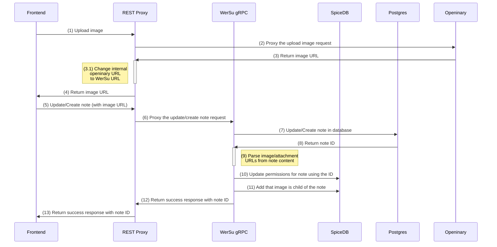

# Images
The following diagram shows how image upload is handled

### Components:
- Frontend: the Docs Page on the browser
- REST Proxy: a REST API which acts as mediator mainly between WerSu gRPC and other internal services. It also handles user authentication
- WerSu gRPC: the main component as gRPC Server, which creates notes, updates notes, creates permissions, creates embeddings, creates users etc
- SpiceDB: a Database for permissions and relations
- Postgres: a Database, where WerSu gRPC stores notes and users into
- Openinary: a Database and API which handles images (and previews)


1. The user uploads an image. This image is sent to the REST Endpoint which acts mostly as proxy
2. The REST Proxy will proxy the upload to Openinary, an image store
3. Openinary returns the URL where to access the image from
    - 3.1 The Restproxy will change the interal Openinary URL like https://localhost/123 to https://wersu.inu-the-bot.com/attachment?type=image&id=123 which will be accessable from the frontend
4. Return this updated URL
5. Now the Frontend inserts the image into the note using it's ID, so that note content looks like this:
    ```
    ...
    
    ...
    ```
    Now this content is sent to the REST Proxy
6. The REST Proxy proxies this POST-Request to WerSu gRPC
7. WerSu gRPC will create or update the note in the Postgres Database
8. Postgres will return the ID of the note (lets take 42 as example)
9. WerSu gRPC parses image URLs out of the content
10. WerSu gRPC will create following relations and send them to SpiceDB:
    - `note:42#admin@user:alice` alice is admin of note 123
    - `directory:docs#parent@note:42` note 42 belongs to the docs directory
11. WerSu gRPC will create the `note:42#parent@attachment:123` relation, which means that attachment 123 belongs to note 42
12. WerSu gRPC now returns the note ID to the REST Proxy
13. The REST Proxy proxies the response back to the frontend