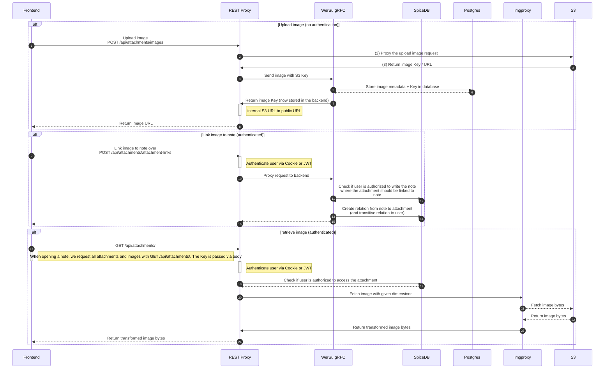

# Images
The following diagram shows how image upload is handled

### Components:
- Frontend: the Docs Page on the browser
- REST Proxy: a REST API which acts as mediator mainly between WerSu gRPC and other internal services. It also handles user authentication
- WerSu gRPC: the main component as gRPC Server, which creates notes, updates notes, creates permissions, creates embeddings, creates users etc
- SpiceDB: a Database for permissions and relations
- Postgres: a Database, where WerSu gRPC stores notes and users into
- Openinary: a Database and API which handles images (and previews)

```mermaid
sequenceDiagram
    autonumber
    participant Frontend
    participant REST Proxy
    participant WerSu gRPC
    participant SpiceDB
    participant Postgres
    participant imgproxy
    participant S3

    alt Upload image (no authentication)
    Frontend->>REST Proxy: Upload image<br/>POST /api/attachments/images
    REST Proxy->>S3: (2) Proxy the upload image request
    S3->>REST Proxy: (3) Return image Key / URL
    REST Proxy->>WerSu gRPC: Send image with S3 Key
    WerSu gRPC->>Postgres: Store image metadata + Key in database
    Postgres-->>WerSu gRPC:
    WerSu gRPC->>REST Proxy: Return image Key (now stored in the backend)
    activate REST Proxy
    Note right of REST Proxy: internal S3 URL to public URL
    deactivate REST Proxy
    REST Proxy-->>Frontend: Return image URL
    end

    alt Link image to note (authenticated)
    Frontend->>REST Proxy: Link image to note over<br/>POST /api/attachments/attachment-links
    activate REST Proxy
    Note right of REST Proxy: Authenticate user via Cookie or JWT
    deactivate REST Proxy
    REST Proxy->>WerSu gRPC: Proxy request to backend
    WerSu gRPC->>SpiceDB: Check if user is authorized to write the note<br/>where the attachment should be linked to<br/>note#write@user
    SpiceDB-->>WerSu gRPC:
    WerSu gRPC->>SpiceDB: Create relation from note to attachment<br/>(and transitive relation to user)
    SpiceDB-->>WerSu gRPC:
    WerSu gRPC-->>REST Proxy:
    REST Proxy-->>Frontend:
    end

    alt retrieve image (authenticated)
    Frontend-->>REST Proxy: GET /api/attachments/
    activate Frontend
    Note right of Frontend: When opening a note, we request all attachments and images with GET /api/attachments/. The Key is passed via body
    deactivate Frontend
    activate REST Proxy
    Note right of REST Proxy: Authenticate user via Cookie or JWT
    deactivate REST Proxy
    REST Proxy->>SpiceDB: Check if user is authorized to access the attachment
    SpiceDB-->>REST Proxy:
    REST Proxy->>imgproxy: Fetch image with given dimensions
    imgproxy-->>S3: Fetch image bytes
    S3-->>imgproxy: Return image bytes
    imgproxy->>REST Proxy: Return transformed image bytes
    REST Proxy-->>Frontend: Return transformed image bytes
    end
```
1. User uploads an image via frontend
2. REST Proxy puts the image via S3
3. S3 returns the image key
4. REST Proxy sends the image key to WerSu gRPC (the actual backend)
5. WerSu gRPC stores the image metadata and key in Postgres
6. Postgres returns
7. WerSu gRPC returns the image (S3) key to REST Proxy
8. The REST Proxy transforms the internal S3 URL to a public URL which contains the actual S3 key and returns it to the frontend
9. After the frontend receives the image URL and hence the attachment key, it can link it to the actual note. Hence it calls `POST /api/attachments/attachment-links` with the note ID and attachment key
10. The REST Proxy authenticates the user either with Cookie or JWT and forwards the request to WerSu gRPC
11. WerSu gRPC checks with SpiceDB if the user is authorized to write the note via `note#write@user` (write is the permission, which is required to link an attachment to a note)
12. SpiceDB returns the result to WerSu gRPC
13. WerSu gRPC creates a relation from the note to the attachment (e.g. `attachment#parent@note`). This way, a request if a user can access an attachment is checked transitively by checking if the user has access (view) to the note. There are no direct permissions for attachments.
14. SpiceDB returns the result to WerSu gRPC
15. WerSu gRPC returns the result to REST Proxy
16. REST Proxy returns the result to the frontend
17. When the user opens a note, then the frontend makes a request to `GET /api/attachments/` or `GET /api/attachments/images[image-params]` to fetch all attachments and images for the note. The attachment key is passed via body, since it contains slashes which results in broken URLs if we passed it via query params. 
18. The REST Proxy authenticates the user either with Cookie or JWT and checks with SpiceDB if the user is authorized to access the attachment via `note#view@user`. 
19. SpiceDB returns the result to REST Proxy
20. The REST Proxy fetches the image from imgproxy with the given dimensions (for example w=100&h=100&fit=crop)
21. imgproxy fetches the image bytes from S3
22. S3 returns the image bytes to imgproxy
23. imgproxy returns the transformed image bytes to REST Proxy
24. REST Proxy returns the transformed image bytes to the frontend