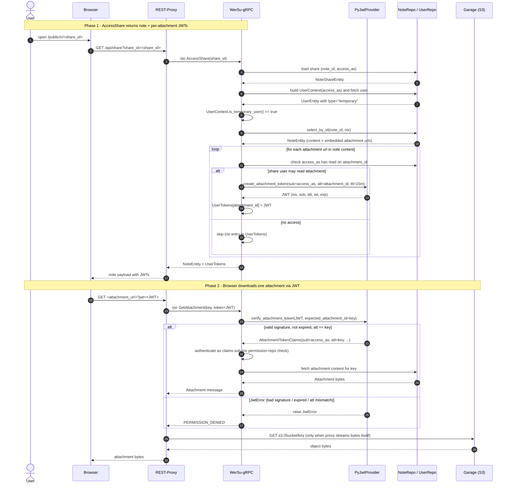

# Authorization and Authentication with JWTs

The WerSu gRPC service currently only uses JWTs for public attachment access.
When a user, using a share link, accesses a note (with a, from the proxy created JWT-Token),
then the internally used `UserContextABC.is_temporary()` will be true. Hence the `NoteService`
will check the note content and scan it for attachments (by url). For each attachment found, it
will check, if the public share user has access to. If this is the case, then the service will
fill out the credentials within the `UserTokens`, which gets returned along the `NoteEntity`.
`UserTokens` then has a dictionary, which maps an attachment_id to an JWT-Token, which can
get used (`url?jwt=${JWT}`) for 15 minutes to access attachments. WerSu Rest will be the Proxy,
which evaluates the tokens generated here.

## Flow: share-link note access + per-attachment JWTs

The diagram below covers two requests back-to-back:

1. `AccessShare` returns the note and, for every embedded attachment the
   share user can read, a freshly minted 15-minute JWT.
2. The browser uses one of those JWTs (`url?jwt=...`) to fetch the
   attachment binary from the REST Proxy, which forwards the token to
   `GetAttachment` so WerSu-gRPC can authenticate the request by the
   `sub`/`att` claims alone.



## Token shape

```json
{
    "iss": "WerSu gRPC",
    "sub": "<user_id of the share's access_as user>",
    "att": "<attachment_id>",
    "iat": "<now (unix seconds)>",
    "exp": "<now + 900>"
}
```

* `iss` is fixed at construction time of `PyJwtProvider`. The same
  secret (`JWT_SECRET` env var) is used by the REST Proxy when it
  forwards `url?jwt=...` to `GetAttachment`, so both sides verify the
  same key.
* `sub` carries the share's `access_as` user id. The receiver treats
  it as the authenticated user id without an extra permission lookup.
* `att` is the binding to one specific attachment. `verify_attachment_token`
  rejects the call when `att != expected_attachment_id`, so a token
  minted for attachment A cannot be replayed against attachment B.
* Lifetime is 15 minutes by default (`ttl_seconds=15 * 60`).
