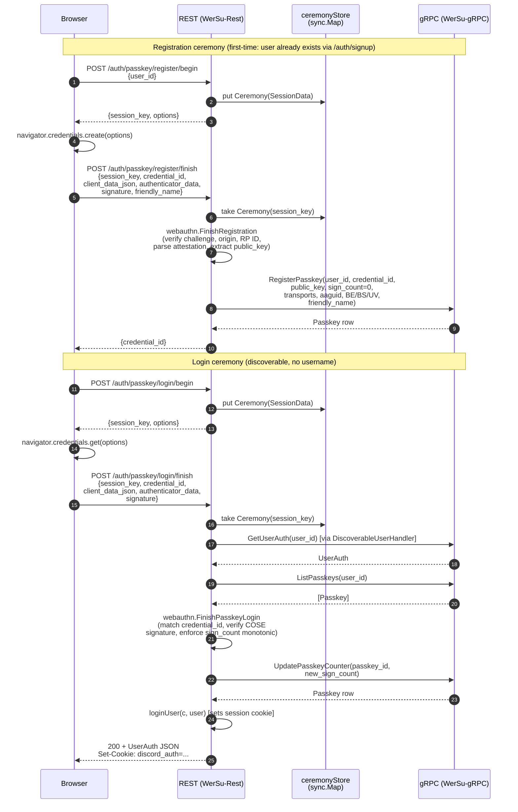
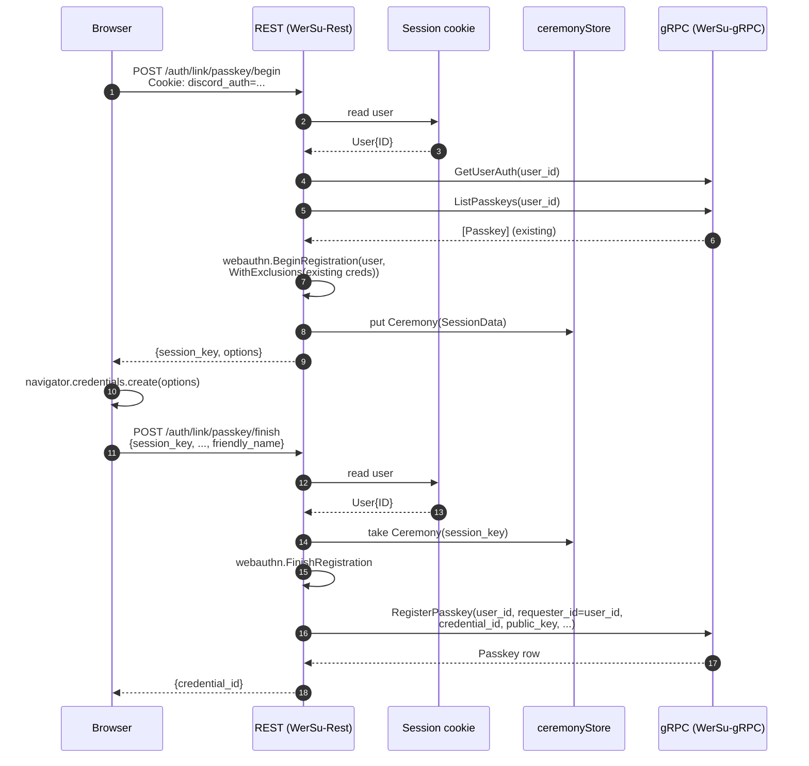

# Passkeys

This document describes how passkey (WebAuthn) login and registration
flow through the three layers of the auth stack: the browser, the
REST edge (`WerSu-Rest`), and the gRPC backend (`WerSu-gRPC`). It is
intended as a reading companion to [src/proto/auth.proto](../src/proto/auth.proto)
and [src/controllers/auth_controller.go](../src/controllers/auth_controller.go).

## Why split the ceremony across two services?

WebAuthn needs the relying party (RP) to do three things that gRPC is
not designed for:

1. Hold a challenge and the rest of the ceremony state between the
   `/begin` and `/finish` calls. gRPC is request/response - there is
   no place to park state server-side without a dedicated table.
2. Drive the browser via `navigator.credentials.create()` /
   `.get()`. The wire format is the WebAuthn JSON dialect, not the
   protobuf payloads gRPC speaks.
3. Run crypto: signature verification, attestation parsing, sign
   counter monotonicity checks. This is best done with a mature
   library (`github.com/go-webauthn/webauthn`) rather than
   re-implemented in two languages.

So the split is:

- **REST** owns the *ceremony* - challenge generation, browser I/O,
  attestation/assertion verification, sign-counter enforcement.
- **gRPC** owns the *credential store* - the `Passkey` table,
  `RegisterPasskey`, `FindPasskey`, `ListPasskeys`,
  `UpdatePasskeyCounter`, `RevokePasskey`. The backend never sees a
  challenge, a clientDataJSON blob, or a signature; it just sees the
  fields it needs to persist or look up.

## What each layer touches

| Layer | Reads from gRPC | Writes to gRPC | Crypto it runs |
|---|---|---|---|
| Browser | none | none | Authenticator signs challenge |
| REST (WerSu-Rest) | `GetUserAuth`, `ListPasskeys`, `FindPasskey` | `RegisterPasskey`, `UpdatePasskeyCounter` | `webauthn.FinishRegistration`, `webauthn.FinishPasskeyLogin` (COSE verify) |
| gRPC (WerSu-gRPC) | none | none | pure storage |

REST's job is to translate "the browser showed me this attestation"
into "store this `(credential_id, public_key, sign_count, ...)` row".
gRPC's job is to keep that row safe and reachable by `(user_id,
credential_id)`.

## Endpoints

| Method | Path | Auth | Purpose |
|---|---|---|---|
| POST | `/auth/passkey/register/begin` | anonymous | Begin a registration ceremony. For first-time signup the caller must already have a user id (created via `/auth/signup`). |
| POST | `/auth/passkey/register/finish` | anonymous | Finish the registration ceremony; persists the new credential via `RegisterPasskey`. |
| POST | `/auth/passkey/login/begin` | anonymous | Begin a discoverable assertion (login) ceremony. |
| POST | `/auth/passkey/login/finish` | anonymous | Finish the assertion; verifies signature, bumps sign counter via `UpdatePasskeyCounter`, sets the session cookie. |
| POST | `/auth/link/passkey/begin` | session | Begin a registration ceremony for an existing user (account settings). Excludes credentials the user already owns. |
| POST | `/auth/link/passkey/finish` | session | Finish the linking ceremony; persists the new credential via `RegisterPasskey`. |

The first-time flow is intentionally **password + passkey**, not
passkey-only: `/auth/signup` mints the user, then
`/auth/link/passkey/{begin,finish}` attaches a credential. A future
"passkey-only signup" would need a way to capture the email at
`/register/begin`; the proto's `RegisterPasskeyRequest` does not
carry an email today, so we leave that for a follow-up.

## Ceremony state storage

REST keeps the `webauthn.SessionData` between the `/begin` and
`/finish` calls in an in-process `sync.Map` on the `AuthController`,
keyed by a random 16-byte nonce returned to the browser as
`session_key`. Entries expire after 5 minutes; a background goroutine
evicts expired entries on a 1-minute ticker.

This is single-replica only. Behind a load balancer the same TTL
plus a sticky session on `session_key` keeps things working, but the
right move for prod is Redis (or any external KV) - the
`AuthController.ceremonyStore` field is the seam.

## Request / response shapes

`/begin` returns:

```json
{
  "session_key": "4f1c...0e",
  "options": { "rp": {...}, "user": {...}, "challenge": "...", ... }
}
```

`/finish` accepts:

```json
{
  "session_key": "4f1c...0e",
  "credential_id": "<base64url raw id>",
  "client_data_json": "<base64url>",
  "authenticator_data": "<base64url>",
  "signature": "<base64url>",
  "friendly_name": "MacBook Touch ID"
}
```

The browser collects the four base64url fields from the
`PublicKeyCredential` object; `session_key` is the one REST-specific
addition that ties the two halves of the ceremony together.

## Sequence diagram



## Linking ceremony (authenticated)

`/auth/link/passkey/{begin,finish}` mirrors the registration
ceremony but the `user_id` and `requester_id` are taken from the
session rather than from the request body. The `BeginRegistration`
call also passes `webauthn.WithExclusions(...)` so the browser's
authenticator picker hides credentials the user already owns (no
double-registration on the same device).



## Configuration

The relying-party identity is configured via environment variables,
loaded in [src/config/config.go](../src/config/config.go):

```
WEBAUTHN_RP_ID=iwillfind.it          # registrable domain (no scheme, no port)
WEBAUTHN_RP_NAME=IWillFindIt         # shown in the authenticator's passkey picker
FRONTEND_URL=https://iwillfind.it    # used as the RP origin for ceremony validation
```

If `WEBAUTHN_RP_ID` is empty, all six passkey endpoints return
`503 Service Unavailable` - matches the existing config.go contract
that passkey support is opt-in.

## gRPC contract

Nothing changes in [src/proto/auth.proto](../src/proto/auth.proto)
for this work. The existing RPCs are sufficient:

| RPC | Used by |
|---|---|
| `GetUserAuth` | Resolve user by id (link + login, via `DiscoverableUserHandler`) |
| `ListPasskeys` | Build the `WebAuthnUser.Credentials` slice with `passkey_id` baked in |
| `RegisterPasskey` | Persist a verified credential after `FinishRegistration` |
| `UpdatePasskeyCounter` | Bump `sign_count` after a successful `FinishPasskeyLogin` |
| `RevokePasskey` | (future) account settings "remove this device" |
| `FindPasskey` | (not used by the REST layer; available for audit flows) |

REST never sends `client_data_json`, `authenticator_data`, or
`signature` to gRPC. It sends only the fields gRPC persists:

```
RegisterPasskeyRequest:
    user_id
    requester_id
    credential_id        (raw bytes)
    public_key           (raw bytes)
    transports           ([]string)
    aaguid               (raw bytes)
    backup_eligible      (bool)
    backup_state         (bool)
    user_verified        (bool)
    friendly_name        (string)

UpdatePasskeyCounterRequest:
    passkey_id
    new_sign_count
```

## Failure modes

| What went wrong | HTTP code | Where it's caught |
|---|---|---|
| `WEBAUTHN_RP_ID` unset | 503 | `webauthnConfigured()` gate at the top of every endpoint |
| Anonymous call to `/auth/link/passkey/*` | 401 | `UserFromContext` |
| `session_key` unknown or expired | 400 | `takeCeremony` |
| Browser's signature fails to verify | 401 | `webauthn.FinishRegistration` / `FinishPasskeyLogin` |
| Sign counter went backwards (cloned authenticator) | 401 | `webauthn.Authenticator.UpdateCounter` |
| gRPC `RegisterPasskey` errors out | 500 | `SetGinError` upgrades Unavailable -> 503 |
| `UpdatePasskeyCounter` errors out (race lost) | 500 | `SetGinError` |
