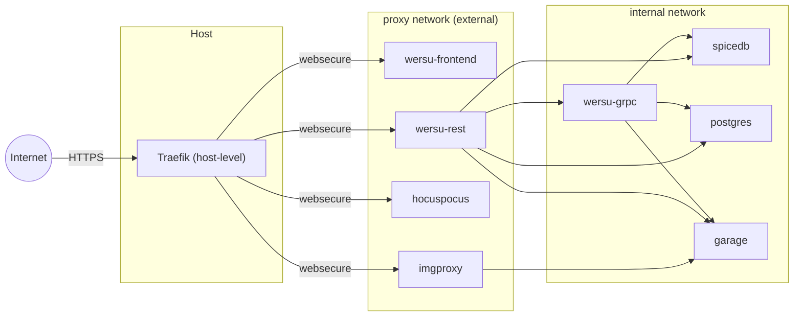

# Production deployment

For how each service fits into the system, see
[project-structure.md](project-structure.md). This page is just about
the prod-specific bits.

## Compose files

- `docker-compose.yaml` - the dev stack, used during development.
- `docker-compose.prod.yaml` - the prod stack, pulls the three
  prebuilt images from `ghcr.io/kuramasyu/*` and assumes a host-level
  reverse proxy is already running.

Both stack their persistent data under `./data/`, so don't run them
at the same time on the same host.

## Network layout

The prod stack uses two networks:

- `proxy` - external network your host-level Traefik is on. Public-facing
  services join it so Traefik can route to them via the standard
  `traefik.*` labels.
- `internal` - compose-managed bridge network for backend traffic.
  Every service is on it; backend-only services stay on it exclusively
  and are unreachable from the internet.



## Deploy and run

The prod compose expects:

- A host-level Traefik already running on the `proxy` Docker network.
  Create it once:
  ```bash
  docker network create proxy
  ```
  Traefik needs a `websecure` entrypoint (HTTPS) and a `letsencrypt`
  certificate resolver configured. ACME email and other Traefik knobs
  live in your Traefik config, not in `.env.prod`.
- Ports 443 free on the host
- `DOMAIN` (e.g. `inu-the-bot.com`) and the four subdomains (`wersu-api.`, `wersu-ws.`, `wersu-img.`, `wersu.`)
- `.env.prod` generated with:
  ```bash
  ./scripts/generate-prod-env.py
  ```
- deploy:
  ```bash
  docker compose -f docker-compose.prod.yaml --env-file .env.prod pull
  docker compose -f docker-compose.prod.yaml --env-file .env.prod up -d
  ```

Update release by changing `IMAGE_TAG` in `.env.prod`


## Env vars

`.env.prod` contains all vars you can change. Try to not change others. The defaults live in
`scripts/.env.prod.template`; the helper script generates a
`.env.prod` from it. The template's block layout maps directly onto
the prompts the script shows:

- **Public config** - `IMAGE_TAG`, `DOMAIN`, `FRONTEND_HOST`,
  `DISCORD_CLIENT_ID`, `DISCORD_CLIENT_SECRET`.
- **Storage credentials** - postgres role + database + password; garage
  access key + secret + bucket.
- **Auto-generated secrets** - `SPICEDB_PASSWORD`,
  `GRPC_SPICEDB_CREDENTIALS`, `JWT_SECRET`, `SESSION_SECRET`. Filled
  with `secrets.token_hex(...)` at script time.
- **Derived URLs** - `DISCORD_REDIRECT_URI`, `FRONTEND_URL`,
  `BACKEND_URL`, `IMGPROXY_ADDRESS`. Composed from `DOMAIN` /
  `FRONTEND_HOST`.
- **Service runtime config** - internal hostnames and ports
  (`DATABASE_DSN`, `GRPC_HOST`, `GRPC_SERVER_ADDRESS`,
  `IMGPROXY_USE_S3`, etc.). Don't edit these unless you know why.

`JWT_SECRET` is shared between `wersu-grpc`, `wersu-rest` and `hocuspocus`


# Development details
## What lives where

Service responsibilities are in [project-structure.md](project-structure.md).
Image sources are in the table below.

| Image                            | Repo                          |
| -------------------------------- | ----------------------------- |
| `ghcr.io/kuramasyu/wersu-grpc`     | `KuramaSyu/WerSu` |
| `ghcr.io/kuramasyu/wersu-rest`     | `KuramaSyu/WerSu-Rest`        |
| `ghcr.io/kuramasyu/wersu-frontend` | `KuramaSyu/WerSu-Frontend`    |

The frontend image bakes in `VITE_BACKEND_URL` and
`VITE_HOCUSPOCUS_WS_URL` at build time. Changing those requires a
frontend rebuild, not just a `.env.prod` change.

`hocuspocus` has no published image; the prod compose builds it from
`infrastructure/hocuspocus/` inline.
