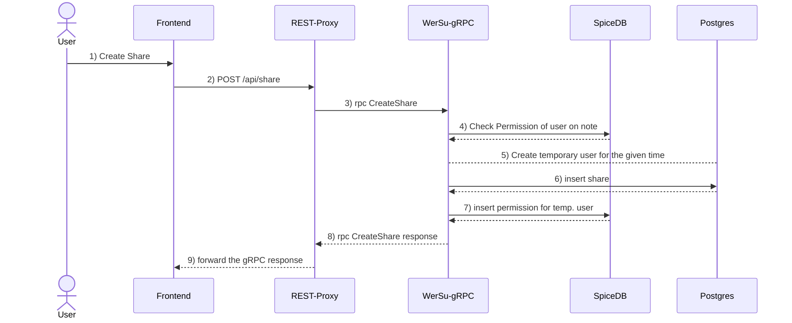
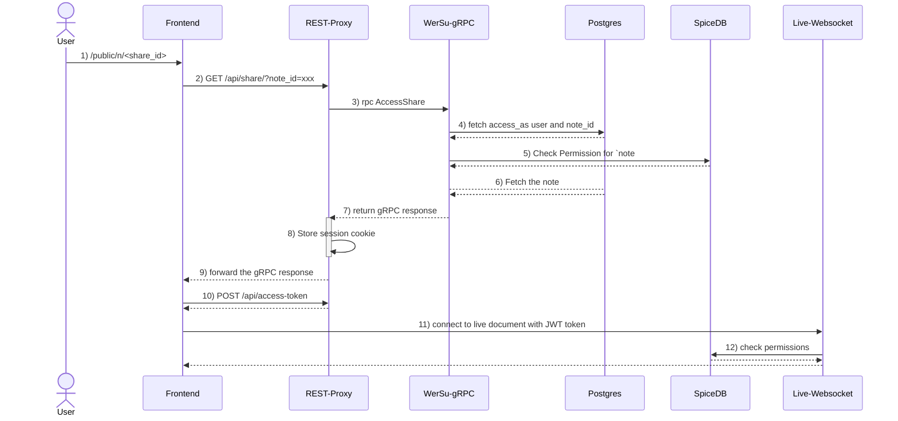

# How sharing a note and real-time editing works
Short reference: 
- **Frontend**: the website
- **REST-Porxy**: the REST API to access and create notes and users
- **WerSu-gRPC**: the service which actually holds and manages the users and notes
- **Postgres**: the database where users and notes are stored (their names, contents etc)
- **SpiceDB**: a service to check which permission a user has

More to that here: [KuramaSyu/WerSu/docs/project-structure.md](https://github.com/KuramaSyu/WerSu/blob/main/docs/project-structure.md)
### Creating a share

To keep it simple, this only describes the successful request to create a share.
If the request fails at some point, then an error will be returned.

1. The user creates a share on the note page
2. The frontend calls POST `api/share` with the `note_id` and the `user_id`
3. The REST Proxy converts the request to a gRPC call
4. WerSu-gRPC makes a `note#permission_edit@user` permission check against SpiceDB
5. Firstly, create a temporary user. This user will be used from others accessing the link,
to actually retrieve the note. When creating a share with link-only, then this temporary user 
will get the necessary permissions to either read or write the note.
6. Create a share with temporary user and the time this share is valid for
7. Create permissions `note#read@user` or `note#write@user` for that temporary user
8. and 9. return the result containing valid time, share_id which will be used to create the link

### Accessing a share


1. The user receives a link like `https://inu-the-bot.com/public/n/42`
2. Make a GET `/api/share/?note_id=42` call to the REST-Proxy
3. Forward that request over gRPC
4. Fetch the share entity from Postgres. This will return the `note_id` the document is associated with as well as a
`access_as` user id, which is the user id with all the permissions on that note.
5. Fetch the permissions for that user. This should either return a `note#write@user` or `note#read@user`. 
6. Now where permissions where checked, fetch the note by it's id
7. Return this response to the REST-Proxy
8. Store a session cookie, where the `user_id` is the `access_as` id. Later when creating a JWT (a **J**SON-**W**eb-**T**oken),
this `access_as` id will be embedded as `sub`
9. Convert the response and return it the frontend
10. If the user has WRITE permission on the note, then request a JWT-Token with POST `/access-token` which will
    generate a JWT Token in the following format:
    ```json
    {

        "sub": "<user id of access_as which comes from the session cookie>",
        "exp": "<Now + 15 Minutes>",
        "iss": "wersu-rest-proxy",
        "iat": "<Now>"
    }
    ```
    More to the generation here: [https://github.com/KuramaSyu/WerSu-Rest/blob/main/src/controllers/auth.go#L227-L249](https://github.com/KuramaSyu/WerSu-Rest/blob/main/src/controllers/auth.go#L227-L249)
11. Now where the user has the JWT, start the WebSocket connection to `Live-Websocket` to enable live-editing of the note. The live WebSocket will evaluate the JWT 
12. and make a permission check `note#write@user` where the user id is the `sub` value from the JWT. This is also, how live-editing works, when you are logged in. The only difference is, that the session cookie instead contains your user id instead of the `access_as` temporary user, which gets access to this one note for a period of time.

#### Why do we even need a JWT and a session cookie, when the note can be read by anyone who can access the link?
The problem is the live-collaboration part (the `Live-Websocket`). The WebSocket has no connection to `WerSu-gRPC` which contains the note content - or more precisely PostgreSQL holds the note content. But with live-collaboration the first time, when a logged-in user edits the document, he will send a Y-Doc to the WebSocket, which contains the content of the note of this point,
which he got from the WerSu-gRPC service. From this point on forward, we will not only have the Document and it's history in the WerSu-gRPC service, and hence PostgreSQL, but also in the memory cache of the WebSocket. 

Now there is one big issue with that. Now, where the WebSocket will have the latest version of each document, how does it verify if a user has permission to access the note? Surly you can pass `user_id: naruto, note_id: shadow-clone-technique` to the WebSocket and the WebSocket can check if `naruto` has permission to write on note `shadow-clone-technique`: `note:shadow-clone-technique#write@user:naruto` which will return true, but how does the WebSocket in the first place even knows, that `naruto` is actually `naruto`? If naruto wanted to access the `tsukuyomi` then `{user_id: naruto, note_id: tsukuyomi}` would evaluate as false, since `tsukuyomi` belongs to the user `Itachi Uchiha`. But you could just trick the WebSocket and send `{user_id: "Itachi Uchiha", note_id: "tsukuyomi"}` and the WebSocket would evaluate it as true and grant you access to edit the live document. Hence, you will need to request a JWT at the `REST-Proxy` which takes your `user_id` out of the session cookie which is either your real user id when you are logged in, or otherwise the `access_as` user id of the temporary user used to access the note with a share link. Then, now that the `REST-Proxy` nows that you are the person you said you are (e.g. you are authenticated now), it generates a JWT, where the `sub` field will contain your user id which is definitely valid. Now you can take this JWT and send it to the WebSocket along with the note id you want to access. The WebSocket can now verify, if the JWT was not manipulated and, as a result of this, check if the user, provided by that JWT has access to the note - and get the result. Now - even a public not logged in user is authenticated and authorized to access a certain note.  