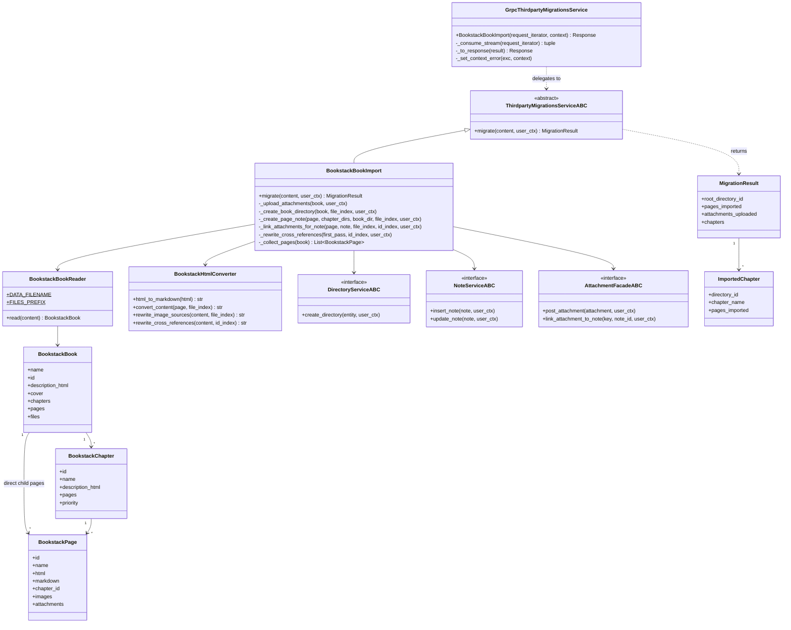
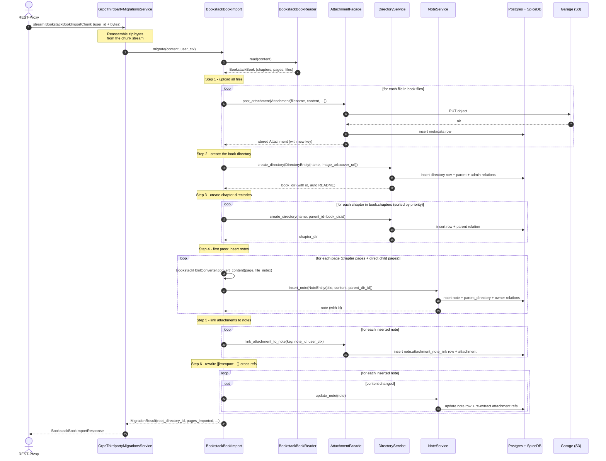

# BookStack Book Import

This document describes how a BookStack portable book zip
(`data.json` + `files/`) is imported into the WerSu gRPC service.

Currently only the BookStack source is implemented.  Future sources
(Notion, Confluence, Obsidian) will be added as additional
implementations of `:class:`ThirdpartyMigrationsServiceABC`` against
the same proto.

## Components

- **Frontend** / **REST-Proxy** — the browser talks to the REST Proxy,
  which forwards the request to WerSu-gRPC.
- **WerSu-gRPC** — hosts the new
  `ThirdpartyMigrationsService` gRPC service.  Its
  `BookstackBookImport` RPC is client-streaming: the client streams the
  zip bytes in 1 MB chunks.
- **BookstackBookImport** — the application service in
  `src/services/thirdparty_migrations/bookstack.py`.  Orchestrates the
  four-step pipeline and delegates persistence to the existing
  `DirectoryService`, `NoteService` and `AttachmentFacade`.
- **SpiceDB** — permissions; receives `note#parent_directory`,
  `directory#parent` and the auto-granted `directory#admin` relations.
- **Postgres** — note and directory rows.
- **Garage (S3)** — attachment bytes.

## Class diagram

`GrpcThirdpartyMigrationsService` is intentionally thin.  It only
reassembles the streamed zip bytes, builds the `user_ctx` via
`RepoContextFactory`, and maps service exceptions to gRPC status
codes.  All the real work is done by `:class:`BookstackBookImport``,
which composes the three existing services (`DirectoryService`,
`NoteService`, `AttachmentFacade`) plus the two parsers
(`BookstackBookReader`, `BookstackHtmlConverter`).

## Sequence diagram

Step-by-step:

1. The REST-Proxy streams the zip bytes into the gRPC RPC as a
   series of `BookstackBookImportChunk` messages.  The first chunk
   carries the `user_id`; later chunks may leave it empty.
2. `GrpcThirdpartyMigrationsService` reassembles the bytes and calls
   `BookstackBookImport.migrate(content, user_ctx)`.
3. `BookstackBookReader` parses the zip: it pulls `data.json` for the
   chapter / page tree and loads every binary under `files/` into
   `book.files` (a filename -> bytes dict).
4. **Step 1 - upload all files.**  Each file becomes an
   `Attachment` via `AttachmentFacade.post_attachment`, which writes
   bytes to Garage (S3) and metadata to Postgres.  The new attachment
   key is recorded in `file_index: dict[filename -> key]`.  An
   `id_index` is also built from the explicit `images[]` /
   `attachments[]` entries on each page so that `[[bsexport:image:N]]`
   cross-refs can be rewritten in step 6.
5. **Step 2 - create the book directory.**  The cover image (if any)
   is uploaded with the rest, wrapped in an `/api/attachments/image?`
   URL via `build_attachment_url`, and stored on the new directory's
   `image_url`.  `DirectoryService.create_directory` auto-grants the
   caller `admin`, auto-creates the README note, and (because
   `parent_id` is left as `None`) places the book at the top level.
6. **Step 3 - create chapter directories.**  For each chapter (sorted
   by `priority`) the importer calls
   `create_directory(name, parent_id=book_dir.id)`.  This writes the
   `directory#parent` relation, so chapter directories are nested
   under the book directory.
7. **Step 4 - first pass: insert notes.**  For every page (chapter
   pages and direct child pages, sorted by `priority`),
   `BookstackHtmlConverter.convert_content` picks `page.markdown` when
   non-empty, otherwise runs `html2text` on `page.html`, and rewrites
   every `` / `` reference to the
   new attachment URL.  The note is inserted via
   `NoteService.insert_note`, which writes the `parent_directory`
   relation and the `owner` relation.  Direct child pages go under
   the book directory; pages inside a chapter go under that chapter's
   directory.
8. **Step 5 - link attachments to notes.**  For every inserted note,
   `extract_attachment_ids(note.content)` is called to find every
   `/api/attachments/image?key=...` URL inline, and every image in
   `page.images[]` is added on top.  Each unique key is linked via
   `AttachmentFacade.link_attachment_to_note`, which inserts both a
   `note.attachment_note_link` row and the
   `attachment#parent_note@note` relation.
9. **Step 6 - rewrite cross-refs.**  BookStack pages may contain
   `[[bsexport:image:N]]` / `[[bsexport:attachment:N]]` cross-refs.
   After all notes are inserted and every old id has a known
   `id_index` target, each note's content is rewritten and persisted
   via `NoteService.update_note`.  `update_note` re-extracts
   attachment refs from the new content, so this single step also
   handles the case where a rewritten cross-ref introduced a fresh
   attachment URL that should now be linked.
10. The service returns `MigrationResult(book_directory_id,
    pages_imported, attachments_uploaded, chapters)`, which the
    gRPC adapter maps to `BookstackBookImportResponse`.

## Error handling

The whole pipeline is **best-effort**.  Per-page failures (insert,
update) and per-attachment failures (upload, link) are logged and
skipped so that one bad page does not abort the import.  Only the
following errors short-circuit the request:

- `BookstackZipError` (raised by the reader when the bytes are not a
  zip, are missing `data.json`, or do not contain a `book` key) ->
  mapped to gRPC `INVALID_ARGUMENT`.
- `PermissionError` (raised by any of the three downstream services)
  -> mapped to `PERMISSION_DENIED`.
- Empty / missing `user_id` or empty content on the streamed RPC ->
  `INVALID_ARGUMENT`.

Unknown errors fall through to `INTERNAL` so the gRPC client gets a
proper status code instead of a hang.

## Directory naming

The orchestrator sets `display_name=chapter.name` on every chapter
directory and `display_name=book.name` on the book directory.  The
frontend renders the directory name from the `display_name` column,
so leaving it as `UNDEFINED` would show the chapter as blank in the
UI.  The orchestrator-level fix is what matters; the auto-README
note still does not override the display name (it only sets the
description and image).